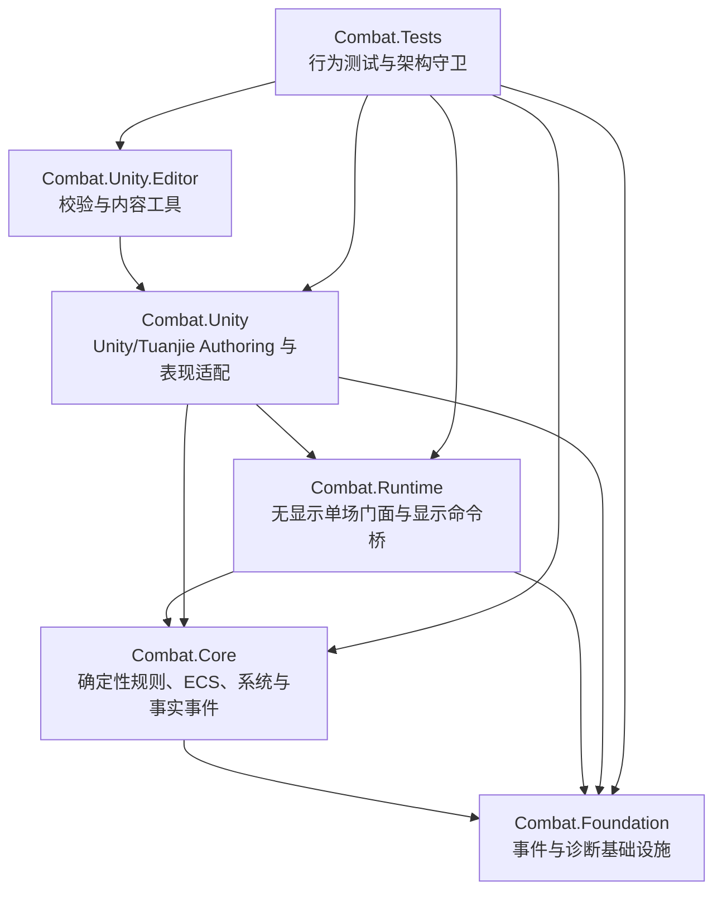
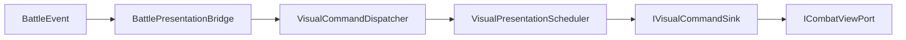

# 架构总览

`com.joyfort.combat` 是确定性、可无显示运行、可由 Unity/Tuanjie Authoring 驱动的战斗框架。它负责单场战斗事实，不负责地牢、波次、关卡、经济、奖励、存档或 UI 等上层玩法。

## 分层与依赖方向



不可反转的边界：

- `Combat.Foundation`、`Combat.Core`、`Combat.Runtime` 不引用 `UnityEngine`。
- `Combat.Core` 是位置、朝向、行动、效果、状态、projectile、死亡和胜负的权威。
- `Combat.Runtime` 只推进或消费 Core 事实，不替 Core 决策。
- `Combat.Unity` 可以显示、插值、池化和播放动画，但不能根据 GameObject 或动画状态反推规则事实。
- 包内生产程序集不引用消费项目、具体玩法、UI Framework 或依赖注入容器。

## 目录职责

| 目录 | 程序集 | 职责 |
| --- | --- | --- |
| `Runtime/Foundation` | `Combat.Foundation` | 事件容器、事件流、日志接口和诊断基础设施 |
| `Runtime/Core` | `Combat.Core` | 战斗配置、确定性数值、ECS 世界、输入/意图、系统、效果、状态、projectile、Spatial 和事件 |
| `Runtime/Runtime` | `Combat.Runtime` | `BattleInstance`、`BattleStepOutput`、初始呈现交接、显示命令派发和显示调度 |
| `Runtime/Unity` | `Combat.Unity` | ScriptableObject Authoring、转换、GameObject viewport、动画、池化和调试组件 |
| `Editor` | `Combat.Unity.Editor` | Authoring 校验、Spatial Map Editor、Collider 单向导入和 Sprite 工具 |
| `Tests/EditMode` | `Combat.Tests` | Core/Runtime/Unity 行为测试、确定性测试、性能合同和程序集守卫 |

## 规则运行入口

无显示或应用层集成应以 `BattleInstance` 为入口：

1. 用 `BattleConfig` 创建 `BattleInstance`。
2. 立即消费构造产生的 `InitialOutput.Events`。
3. 每个固定战斗 Tick 调用一次 `TickOnce(BattleInputFrame)`。
4. 在下一次可能清空事件缓冲区的操作前同步消费 `BattleStepOutput.Events`。
5. 使用 `BattleResult` 和只读 unit runtime snapshot 构建上层玩法状态。

`BattleStepOutput.Events` 是当前 simulation event buffer 的同步视图，不是长期拥有的事件集合。消费项目如果需要缓存、回放或跨层传递，必须先复制事件。

需要把 initial facts 交给显示层时，可使用 `BattleInitialPresentationComposition`：

```text
create composition
  -> consume InitialOutput.Events
  -> CompletePresentation()
  -> obtain BattleInstance
```

需要在复制事件之后才提交日志诊断的 application adapter，可以使用 `*WithDeferredDiagnostics` 与幂等 `CommitCurrentDiagnostics()`；顺序必须是“先复制事实，再提交诊断”。

## Core 事实与命令

`BattleSimulation.Step()` 每次只推进一个 `BattleTick`。系统不直接进行随意结构变更，而是通过 `EntityCommandBuffer` 和固定 flush 边界结算：

- spawn command：创建单位或 projectile。
- action command：启动 ability action。
- effect command：结算 Damage、Heal、ApplyStatus、SpawnProjectileEmitter 和 AreaEffect。
- death check：在 effect batch 内按固定顺序确认死亡。
- structural command：延迟销毁和组件增删。

精确阶段顺序见 [Combat 系统参考](combat-systems-reference.md)。

## 确定性数值

影响模拟状态、回放、移动、范围、projectile、碰撞、裁剪或胜负的 Core 计算使用：

- `BattleScalar`
- `BattleVector2`

`float` 可以存在于 Unity Authoring、显示、日志和外部 API 边界，但进入 Core definition、spawn data、component 或 projectile runtime payload 前必须转换。当前客户端由 FixedMathSharp-backed `BattleScalar` 提供底层实现。

稳定结果还依赖：

- 单位候选和范围结果以 `UnitId` 作为稳定 tie-break。
- Spatial proxy 使用正数且唯一的 `SpatialProxyId`。
- projectile 候选按 `(ProjectileId, Fraction, TargetUnitId)` 稳定处理。
- 规则结果不依赖 `Dictionary`、`HashSet` 或输入数组的未声明枚举顺序。

## 主要规则模块

| 模块 | 权威职责 |
| --- | --- |
| `BattleWorld` | ECS 状态、组件注册、领域 ID 索引和所有 flush 的 facade |
| `BattleSimulationPhasePipeline` | `Step()` 内部静态系统顺序、性能采样边界和 victory checkpoint |
| `BattleUnitQuery` | 存活单位、阵营、半径、最近和最低生命候选的统一只读语义 |
| `AbilityTargeting` | ability 自动与显式目标的统一校验 |
| `BattleEffectRuntimeDataFactory` | definition 到 runtime effect data 的预转换 |
| `BattleEffectCommandFactory` | runtime effect data 到 effect command |
| `BattleEffectResolver` | 最终 effect 结算 |
| `StatusApplicationResolver` | status 创建、刷新和叠层 |
| `BattleModifierResolver` / `BattleStatResolver` | damage 与 effective stat 计算 |
| `StatusTriggerResolver` | 明确 hook 上的 trigger 扫描和 reaction 入队 |
| `Combat.Core.Spatial` | 无 Battle 领域语义的确定性二维几何和查询 |

## Runtime 与表现层



- `BattlePresentationBridge` 同步消费事件，不推进模拟。
- `VisualCommandDispatcher` 把事实映射为 typed `VisualCommand`。
- `VisualPresentationScheduler` 只仲裁 action/locomotion 显示通道。
- `VisualTimelineRunner` 可以延迟显示命令，但不改变 Core Tick 或事件顺序。
- `NullCombatViewPort` 用于 headless，`RecordingCombatViewPort` 用于测试，`UnityCombatViewPort` 用于 Unity GameObject 显示。

完整映射和 Authoring 边界见 [Authoring 与表现层](authoring-and-presentation.md)。

## 消费项目职责

以下能力必须位于消费项目：

- 关卡、地牢、波次、房间和任务流程。
- 五人小队编成、职业、装备、成长和局外系统。
- 应用 Tick host、暂停、倍速和跨战斗生命周期。
- 存档、网络、回放文件格式和业务日志。
- UI、输入设备适配、场景组合和依赖注入。
- 具体单位、技能、状态、projectile、scenario 和表现资产。

消费项目可以直接组合 `BattleInstance`，也可以定义窄 application gateway。Gateway 不应暴露 `BattleWorld`、`EntityId`、component storage、command buffer 或显示实现。

## 扩展原则

- 新 effect：扩展统一 definition、runtime data factory、command factory 和 resolver，再让 ability/projectile/status/area 复用。
- 新 Core 系统：先定义输入、输出、阶段和 flush，再修改 pipeline 与顺序测试。
- 新目标语义：优先扩展 `BattleUnitQuery` / `AbilityTargeting`，不要在多个系统复制筛选。
- 新 projectile 规则：运动、命中策略和生命周期留在 Core；Unity 只显示事件。
- 新显示能力：先让 Core 输出足够事实，再扩展 Runtime typed payload 和 viewport。
- 新 Authoring：同时扩展 asset、converter、validator 和 EditMode tests。

## 当前限制

- Core 自动胜负只支持“至少一个单位存活且只剩一个队伍”；复杂关卡胜负应由消费项目编排或扩展 `VictorySystem`。
- LocalAvoidance 已实现但默认关闭，不提供静态障碍导航或攻击位置预约。
- Spatial 静态地图 Authoring 已存在，但默认没有 runtime consumer。
- projectile 当前为线性运动，支持首次命中销毁和有限穿透，不支持反弹、无限穿透或同目标重复命中冷却。
- action 支持多 effect frame 和 action locks，但尚无通用 interruption policy、channeling 或 moving cast。
