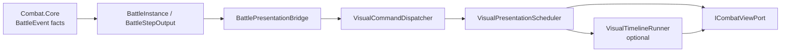

# Authoring 与表现层

本文档说明 `Combat.Unity` / `Combat.Unity.Editor` 如何把 Unity/Tuanjie 内容转换为纯 Core definitions，以及 `Combat.Runtime` 如何把 Core 事实交给具体显示。

## Authoring 原则

- UPM 包提供通用 asset schema、converter、validator 和 Editor 工具。
- 具体单位、技能、状态、projectile、scenario、prefab 和动画资产属于消费项目。
- Authoring 可以使用秒和 `float`；进入 Core 前必须按 scenario TPS 转换为 ticks，并把规则数值转换为 `BattleScalar` / `BattleVector2`。
- `Physics2D` / Collider 只能作为 Editor 单向导入来源，不能成为 runtime 规则权威。
- converter 和 validator 必须共享规则边界，避免“Inspector 可配置但运行时拒绝”或反向漂移。

## 通用资产

| 类型 | 职责 |
| --- | --- |
| `BattleScenarioAsset` | TPS、最大时长、初始单位、自动胜负、LocalAvoidance、projectile culling 与可选 spatial map |
| `CombatantConfigAsset` | definition id、基础属性、半径、基础能力、技能列表、AI 和可选目标行为 |
| `AbilityConfigAsset` | ability id、范围、cooldown、recovery、目标策略、action locks 和有序 effect frames |
| `StatusConfigAsset` | 生命周期、周期伤害、叠层、modifier、trigger condition 和 reaction effects |
| `ProjectileConfigAsset` | behavior、hit policy、radius、speed、lifetime 和 impact effects |
| `ProjectileEmitterConfigAsset` | anchor、duration、fire interval、pattern、direction mode，并引用 projectile |
| `AreaEffectConfigAsset` | radius、目标过滤和 child effects；不支持嵌套/递归 AreaEffect |
| `BattleSpatialMapAsset` | stable ID、Circle/Aabb、center、尺寸和 category/mask；当前是 dormant infrastructure |
| `SpriteAnimationClipAsset` | sprite frames、FPS、loop 和 fallback |
| `SpriteAnimationSetAsset` | animation key 与 ability-specific clip 映射 |
| `CombatantPresentationCatalogAsset` | combatant definition id 到单位 prefab |

`CombatantConfigAsset.Id` 来自 asset 名称。重命名 asset 会改变运行时 definition id，消费项目应把它视为内容标识迁移。

## 时间和数值转换

`BattleAuthoringConverter.BuildBattleConfig(scenario)` 以 scenario 的 `TicksPerSecond` 转换：

- scenario 最大持续时间。
- ability cooldown、effect frame time 和 recovery。
- status duration 与 tick interval。
- projectile lifetime。
- emitter duration 与 fire interval。
- 目标行为的无进展超时和旧目标重试冷却。

没有 scenario 上下文的 standalone converter API 使用 30 TPS 默认值。跨项目内容应优先通过完整 scenario graph 转换，避免时间基准不一致。

以下数据在进入 Core 前转换为确定性类型：

- position、range、radius、speed、culling bounds。
- combatant base stats 中影响规则的 scalar。
- area radius 与 spatial shape。
- condition 的百分比、属性值和距离 operand。

`MoveSpeed` 和 projectile `Speed` 都表示战斗单位/秒；Core 系统在运行时按 TPS 转成每 Tick 位移。

## Effect Authoring

`BattleEffectConfig` 是共享 authoring 项，当前支持：

- `Damage`
- `Heal`
- `ApplyStatus`
- `SpawnProjectileEmitter`
- `AreaEffect`

Ability effect frame、projectile impact、status reaction 和 area child effects 使用同一模型。`BattleEffectAuthoringRules` 集中定义不同 scope 允许的组合：

- top-level ability 的 direct `Heal` 需要 `Self` 或 `LowestHealthAlly` 目标上下文。
- status reaction 和 area child 可以 direct `Heal`。
- projectile impact 不允许没有明确 target context 的 direct `Heal`，可使用 AreaEffect 或 reaction。
- 嵌套/递归 AreaEffect 被 definition、converter 和 validator 拒绝。

## Ability Action Authoring

`AbilityConfigAsset` 使用非空、有序的 `AbilityEffectFrameConfig`：

- `FrameId`
- `TimeSeconds`
- `Order`
- 有序 `BattleEffectConfig[]`

effect frame 是规则 timing 的唯一来源。转换后：

```text
TimeSeconds
  -> TickOffset
  -> AbilityEffectFrame
  -> action ReleaseTick / EndTick
```

`WindupSeconds` 可以用于内容表达和迁移，但不能替代 effect frame timing。`ActionLocks` 原样进入 definition、spawn data、runtime state 和 `AbilityStarted` 事实；默认锁为 `Movement | StartAnotherAction`。

## Projectile Authoring

Projectile 与 emitter 所有权分离：

- `ProjectileConfigAsset` 拥有运动、命中、半径、速度、生命周期和 impact effects。
- `ProjectileEmitterConfigAsset` 只拥有发射时机、位置、pattern、初始方向并引用 projectile。
- 同一个 projectile asset 可以被多个 emitter 复用。

当前 behavior 只有 `Linear`。Hit policy：

- `DestroyOnFirstHit`
- `Pierce(maxHitCount)`，要求 `maxHitCount >= 2`

payload 在转换期编译为不可变 `ProjectilePayload`，进入 emitter/runtime data 的是编译快照，不改变 authoring 所有权。

## Status 与 Condition Authoring

`StatusConfigAsset` 同时配置生命周期、叠层、modifier 和 trigger。Trigger condition 使用一层 `All / Any`，每个比较项由左右 operand 与 comparison 组成；operand/filter 通过 `[SerializeReference]` 多态 concrete config 表达。

converter 把 authoring object graph 编译为不可变 `BattleConditionProgram`，runtime 不解释 Unity managed-reference object tree。详细合同见：

- [Status 系统](status-system-reference.md)
- [Battle Condition](battle-condition-reference.md)

## 校验与 Editor 工具

`BattleAuthoringValidator` 应在内容提交和发布前运行，主要检查：

- 缺失引用、重复 id、非法秒制/数值字段。
- ability effect frame、action locks 和目标上下文。
- status stack、modifier 冲突、trigger condition 编译。
- projectile behavior/hit policy、emitter 引用和 impact effects。
- AreaEffect 递归、半径、filter 和 child scope。
- culling bounds 与 spatial map 数值域。

`BattleSpatialMapEditorWindow` 提供 Circle/Aabb Scene View 编辑、单向 Collider 导入、validate 与 deterministic preview。详细边界见 [Spatial 碰撞系统](spatial-collision-system-guide.md)。

## Core 到显示的数据流



显示层只能消费事实：

- 不根据 GameObject overlap 决定命中。
- 不根据动画帧决定 ability release。
- 不根据显示插值决定 Core position/facing。
- 不根据单位死亡对象推断 projectile 销毁。
- 不根据结果 UI 决定 victory。

## 事件到显示命令映射

| `BattleEventType` | Runtime / viewport |
| --- | --- |
| `UnitSpawned` | `CreateUnit(UnitSpawnViewSnapshot)` |
| `UnitMoved` | `MoveUnit(UnitId, BattleVector2)` |
| `UnitFacingChanged` | `FaceUnit(UnitId, BattleVector2)` |
| `UnitGarrisoned` / `UnitDeployed` | `SetUnitVisibility(false / true)` |
| `AbilityStarted` | `PlayAction(ActionViewSnapshot, ActionLocks)` |
| `AbilityReleased` | 不生成默认显示命令；后续 effect facts 驱动反馈 |
| `AbilityEnded` | Runtime-only `EndAction`，用于解除显示通道锁 |
| `DamageApplied` | `PlayHit(DamageViewSnapshot)` |
| `HealingApplied` | `PlayHeal(HealingViewSnapshot)` |
| `StatusApplied` / `StatusExpired` | `PlayStatusApplied` / `PlayStatusExpired` |
| `UnitDied` | `DestroyUnit(UnitId)` |
| `ProjectileSpawned` | `CreateProjectile(ProjectileViewSnapshot)` |
| `ProjectileMoved` | `MoveProjectile(ProjectileId, BattleVector2)` |
| `ProjectileHit` | `PlayProjectileHit(ProjectileHitViewSnapshot)` |
| `ProjectileDestroyed` | `DestroyProjectile(ProjectileId)` |
| `BattleEnded` | `ShowBattleResult(BattleResult)` |

`VisualCommand` 使用 typed payload。`default(VisualCommand)` 非法；dispatcher、scheduler、timeline 和 applier 都应拒绝它。

## 显示调度

`VisualPresentationScheduler` 维护单位 action/locomotion 显示通道：

- `AbilityStarted.ActionLocks` 包含 `Movement` 时，先输出 `StopUnitMovement`，再输出 `PlayAction`。
- movement lock 存续期间丢弃该单位后续 `MoveUnit`。
- `AbilityEnded` 对应的 `EndAction` 解除 locomotion 阻塞。

这只影响显示命令，不改变 Core action、position 或事件。

`VisualTimelineRunner` 可以延迟 projectile/unit 销毁和 battle result 等显示命令，并保持同一显示时间的稳定排入顺序。它不是规则 timeline。

## Unity View

`UnityCombatViewPort` 负责：

- 创建、池化和回收单位、projectile 与 feedback GameObject。
- 使用 `CombatantPresentationCatalogAsset` 按 definition id 选择 prefab。
- 把单位命令转发到 `CombatUnitView`。
- 播放 sprite animation，推进 transform smoothing。
- 按量化 Y 与稳定 UnitId 派生深度做显示排序。

`CombatUnitView` 可使用：

- `Rotate2D`：按 Core facing 平滑旋转。
- `SideScrollerFlip`：按 facing.x 左右翻转。

Projectile 当前事件没有 velocity/facing。如果表现需要弹道朝向，应扩展 Core event / Runtime snapshot，再由 Unity 显示；不能根据上一帧显示位置猜测规则方向。

## 消费项目组合

推荐把以下对象放在消费项目 composition root：

1. `BattleInstance`
2. 可选 application gateway
3. 可选 `BattlePresentationBridge`
4. `VisualPresentationScheduler`
5. 可选 `VisualTimelineRunner`
6. `ICombatViewPort` 实现

玩法层只读取复制后的 `BattleEvent`、`BattleResult` 和只读 snapshot；UI 只读取玩法 read model。不要让 UI、场景或容器直接扫描 `BattleWorld`。
