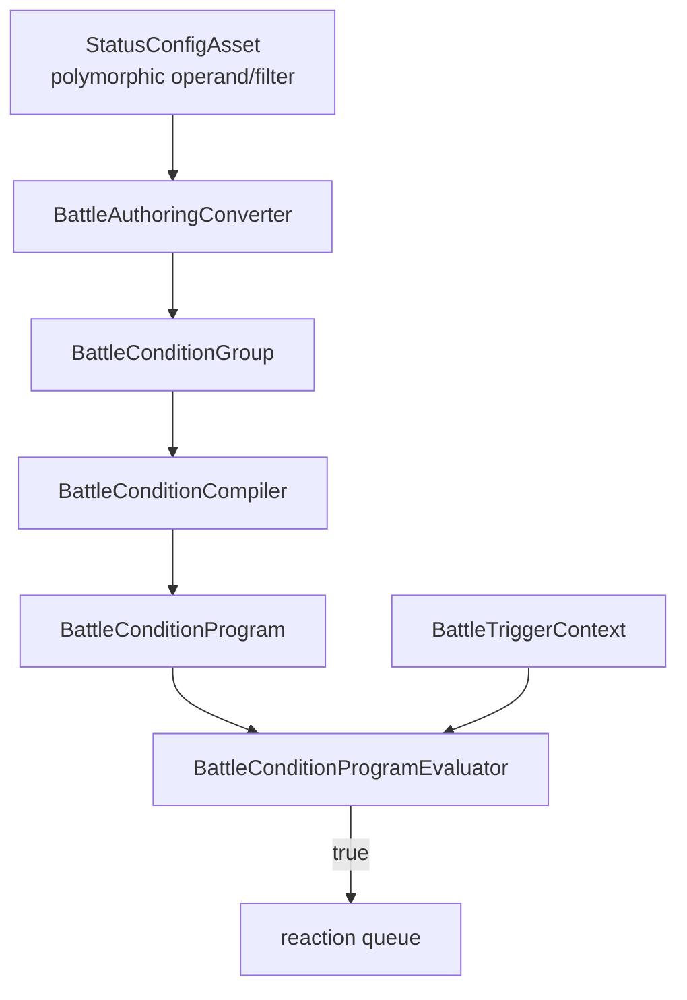

# Battle Condition 参考

Battle Condition 是 Core 中只读、不可变、可编译的 predicate program。当前主要作为 status trigger gate，但模型不依赖 Unity authoring object tree。

## 数据链

- Null 或空 condition group 编译为 `BattleConditionProgram.AlwaysTrue`。
- Runtime definition/instance 保存 program，不保存 managed-reference authoring tree。
- Evaluator 只能读取 world、tick 和 context；不能排命令、写事件或改变 component。

## Program

`BattleConditionProgram` 包含：

| 数据 | 说明 |
| --- | --- |
| `Instructions` | `ConstantBool`、`Compare`、`All`、`Any`、`Not` |
| `Operands` | Compare 引用的 operand data |
| `StatusFilters` | 状态计数 operand 引用的 filter data |

构造时校验 root、operand/filter index、child span、value kind 和 comparison 兼容性。当前 Authoring 只生成一层 `All / Any`；`Not` 已存在于 program，可以在未来 compiler authoring 中接入。

## Evaluation Context

| 字段 | 语义 |
| --- | --- |
| `World` | 当前 Core battle state 的只读查询入口 |
| `Tick` | 当前触发 Tick |
| `Owner` | 拥有 trigger/status/condition 的单位 |
| `Source` | 当前事件发起者 |
| `Target` | 当前事件承受者 |
| `EffectContext` | effect 来源、类型、id 和 tags 上下文 |

当前 timing：

| Timing | Owner | Source | Target |
| --- | --- | --- | --- |
| `AfterDamageDealt` | 造成伤害者 | 造成伤害者 | 受伤者 |
| `AfterDamageTaken` | 受伤者 | 造成伤害者 | 受伤者 |
| `AfterEnemyKilled` | 击杀者 | 击杀者 | 死亡单位 |

新增 Before 类 timing 时必须先定义所在计算窗口、context 语义以及它是 gate 还是返回修改后的值。

## Operand

| Operand | Kind | 读取 |
| --- | --- | --- |
| `LiteralInt` | `Int` | 常量整数 |
| `LiteralPercent` | `Scalar` | Authoring 0-100，转换为 basis points |
| `LiteralScalar` | `Scalar` | `BattleScalar` |
| `LiteralBool` | `Bool` | 布尔 |
| `LiteralIdentifier` | `Identifier` | 字符串标识 |
| `HealthPercent(subject)` | `Scalar` | 当前生命 / effective MaxHealth |
| `StatusCount(subject, filter)` | `Int` | 匹配 status instance 数量 |
| `StatusStackCount(subject, filter)` | `Int` | 匹配 status 的 StackCount 总和 |
| `StatValue(subject, stat)` | `Scalar` | effective `MoveSpeed` 或 `MaxHealth` |
| `DistanceBetween(a, b)` | `Scalar` | `BattleVector2.DistanceScalar` |

Status filter：

- `Any`
- `StatusId`
- `Polarity`

Comparison：

- `Int` / `Scalar`：`Equal`、`NotEqual`、`Less`、`LessOrEqual`、`Greater`、`GreaterOrEqual`
- `Bool` / `Identifier`：仅 `Equal`、`NotEqual`
- 左右 operand 的 value kind 必须一致

影响规则的数值 operand 使用 `BattleScalar` / `BattleVector2`。Core evaluator 不新增 `float`、`double` 或 `System.Math` 路径。

## Authoring

`BattleConditionOperandConfig` 和 `BattleStatusConditionFilterConfig` 是 `[SerializeReference]` 多态基类。每个 concrete config 只暴露自己需要的字段，并负责：

- `BuildDefinition()`
- `Validate(...)`
- value kind
- subject 语义
- 必要的引用收集

`BattleConditionManagedReferenceDrawer` 提供类型选择。Validator 先校验 authoring 字段和 comparison，再构建同语义 group 并调用 compiler，以锁定 validator/converter/compiler 一致性。

## 扩展清单

新增 operand/filter 时同步修改：

1. authoring-facing definition。
2. program runtime data 与校验。
3. compiler。
4. evaluator。
5. Unity concrete config 与 drawer 可发现性。
6. converter/validator 的图引用或特殊校验。
7. compiler、evaluator、converter 和 validator tests。
8. 本文档。

如果 condition 被接入 modifier、AI 或 ability targeting 等更热路径，应先量化执行频率，再考虑 program cache、operand 预绑定、timing index 或分阶段预筛选。
