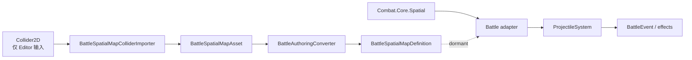

# Spatial 碰撞系统指南

`Combat.Core.Spatial` 是无 Battle 领域语义的确定性二维几何、过滤、宽相和查询内核。当前正式消费者是 projectile 对动态圆形单位的连续碰撞。

## 分层边界



核心约束：

- Spatial 不读取 `BattleWorld`、`EntityId`、`UnitId`、阵营、生命、状态、事件或 Unity 类型。
- Battle adapter 负责领域快照、存活/驻防/阵营过滤、命中策略、生命周期和 effect。
- `Physics2D` / Collider 不参与 runtime collision。
- 影响命中、TOI、过滤和规则结果的计算使用 `BattleScalar` / `BattleVector2`。
- Runtime/Unity 不能根据显示 overlap 或插值位置反推碰撞。

## 能力状态

| 能力 | 状态 |
| --- | --- |
| Circle / Aabb shape 和 bounds | 支持 |
| Circle-Circle overlap | 支持，外切算重叠 |
| Circle-Aabb overlap | 支持，边界相切算重叠 |
| Aabb bounds query | 支持 |
| Circle-Circle sweep / TOI | 支持高速穿越、切线、零位移、初始重叠和终点命中 |
| Circle-Aabb sweep | 不支持 |
| 线性 oracle 查询 | 支持 |
| `DeterministicUniformGrid` | 支持 |
| Projectile 对动态单位连续碰撞 | 支持 |
| 有限穿透与同目标去重 | Battle projectile 层支持 |
| 静态地图 Authoring | 支持，但没有默认 runtime consumer |
| Polygon / OBB / Composite | 不支持 |

## 核心类型

| 类型 | 职责 |
| --- | --- |
| `SpatialProxyId` | 正数、唯一、与输入顺序无关的稳定 ID |
| `SpatialShape2D` | Circle radius 或 Aabb half extents |
| `SpatialAabb` | min/max bounds |
| `SpatialCollisionFilter` | 双向 category/mask |
| `SpatialProxy` | stable ID、position、shape、filter 和 payload index |
| `SpatialSweepHit` / `SpatialHit` | fraction、移动体中心、接触点、法线、初始重叠和 payload |
| `SpatialGeometry` | 固定点 overlap / sweep |
| `SpatialQueries` | 线性查询 oracle |
| `SpatialQueryWorkspace` | 可复用候选/hit 缓冲 |
| `DeterministicUniformGrid` | 稳定 broadphase |
| `SpatialDomain` | 明确的坐标、extent 和 delta 数值域 |

这些类型是 `Combat.Core` 内部实现细节。可持久化的公共配置边界是 `BattleSpatialMapDefinition`。

## 查询合同

### Shape

- 通用 Circle query 允许 radius 为 0；authored map Circle radius 必须大于 0。
- Spatial Aabb 保存 half extents；Authoring 使用完整 size。
- overlap 与 bounds query 把相切视为命中。
- sweep narrowphase 当前只处理 Circle proxy，Aabb proxy 被跳过。

### Filter

双向过滤：

```text
(self.MaskBits & other.CategoryBits) != 0
&& (other.MaskBits & self.CategoryBits) != 0
```

双方必须互相允许。Category/mask 不表达队伍、存活、无敌、驻防或 hit policy。

### 稳定顺序

- overlap / Aabb query 按 `SpatialProxyId`。
- sweep 先按 `Fraction.RawValue`，再按 `SpatialProxyId`。
- projectile resolution 按 `(ProjectileId, Fraction, TargetUnitId)`。
- 规则结果不能依赖未声明的容器枚举顺序。

### Workspace

每次查询前 Reset workspace。查询返回的 view 只在下一次 Reset/查询前有效。调用方应在每场 battle 或 system scratch 中复用 workspace。

## 确定性数值域

| 项目 | 范围 |
| --- | --- |
| 坐标绝对值 | `<= 10000` |
| radius / half extent | `<= 1000` |
| 单 Tick delta 每个分量绝对值 | `<= 10000` |

shape bounds 和 sweep end 也必须在坐标域内。非有限 authoring float 必须在 converter/validator 边界拒绝。Core 不使用 `float epsilon` 修补相切或 TOI。

## Projectile 数据流

一个 active projectile 的碰撞顺序：

1. 保存 `StartPosition`。
2. 按 runtime velocity 计算并写回 Tick 终点。
3. 写 `ProjectileMoved`。
4. 执行 culling；出界后排销毁并跳过碰撞。
5. 构造 start/end/radius snapshot。
6. `BattleUnitQuery` 收集存活且未驻防的 target snapshots。
7. detector 每帧构建一次动态单位 grid，并对 projectile 执行 Circle-Circle sweep。
8. Battle 层验证 entity、source、target、存活、敌我和该 projectile 的 hit memory。
9. `DestroyOnFirstHit` 选择首个有效候选；`Pierce` 按 TOI 选择不同目标直到容量。
10. 每个 selected hit 写 `ProjectileHit` 并排 impact effects。
11. 未耗尽的穿透 projectile 保持 Tick 终点；最后 lifetime Tick 仍可命中。
12. `FlushEffectCommands.Projectile` 结算 effects。

命中位置是 TOI 时的 projectile 中心。Spatial 已提供接触点、法线和 `StartedOverlapping`，但当前没有进入 `BattleEvent` / Runtime payload；需要反弹或精确 VFX 时必须显式扩展 Core hit context。

## LocalAvoidance

`Combat.Core.LocalAvoidance` 与 Spatial 是两个合同不同的模块：

- LocalAvoidance 处理 moving/anchored agents、overlap recovery、速度候选和求解统计。
- Spatial 处理通用 proxy、几何命中和查询。
- `BattleConfig.LocalAvoidanceEnabled` 默认关闭；关闭时 `MovementSystem` 不构建 avoidance grid，直接提交 `PreferredStep`。
- 即使开启，LocalAvoidance 也不提供静态障碍导航、全局路径或攻击位置预约。

没有明确动态单位查询合同前，不强制合并两个 grid。

## 静态空间地图

Authoring 链：

```text
CircleCollider2D / BoxCollider2D
  -> BattleSpatialMapColliderImporter
  -> BattleSpatialMapAsset
  -> BattleAuthoringValidator
  -> BattleAuthoringConverter
  -> BattleSpatialMapDefinition
  -> BattleConfig.SpatialMap
```

导入是单向的。Asset entry 成为权威数据，不保留 Collider 同步。当前 `BattleConfig.SpatialMap` 没有默认 runtime consumer；它不自动产生 projectile 撞墙、单位阻挡或导航。

## 测试合同

| 测试 | 覆盖 |
| --- | --- |
| `SpatialContractsTests` | stable ID、shape/filter/proxy 和数值域 |
| `SpatialGeometryTests` | overlap、TOI、高速穿越、相切和初始重叠 |
| `SpatialQueriesTests` | 排序、过滤、输入顺序独立和 workspace |
| `SpatialUniformGridTests` | 负坐标 floor、重复 ID、oracle 对照、稳定性和分配 |
| `ProjectileCollisionTests` | Battle adapter、友军过滤、sweep 和候选顺序 |
| `BattleProjectileSystemTests` | 生命周期、最早 TOI、穿透、去重和 effect 顺序 |
| `BattleSpatialMapAuthoringTests` | asset 转换、校验和空地图 |
| `BattleSpatialMapColliderImporterTests` | Collider 导入数学与拒绝规则 |

修改 shape、query、filter、sorting、domain、grid、projectile collision 或 map authoring 时，必须运行对应 focused tests、projectile regression、determinism 和 architecture guards。

## 扩展规则

- 新通用几何进入 `Combat.Core.Spatial`，同时提供线性 oracle 与 grid 对照测试。
- 队伍、存活、阵营和 hit policy 留在 Battle adapter。
- 反弹、重复命中和命中冷却属于 projectile runtime，不属于 `SpatialGeometry`。
- 显示接触点/法线必须从 Core event 传到 Runtime，再到 Unity。
- 静态 obstacle response 需要独立产品合同，不能因为已有 map asset 就默认接入。
